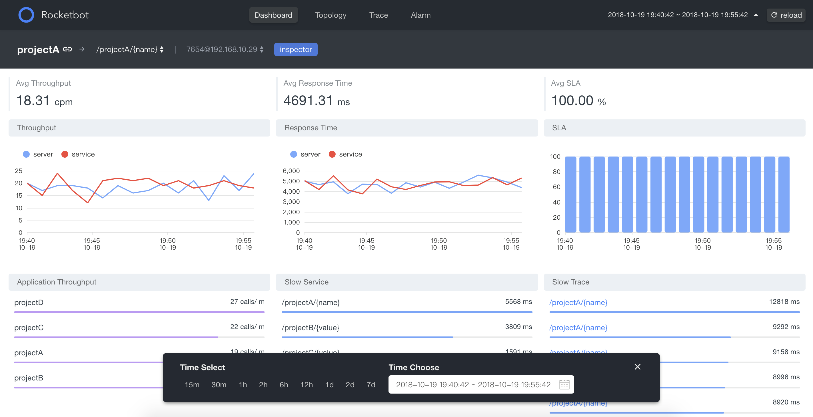
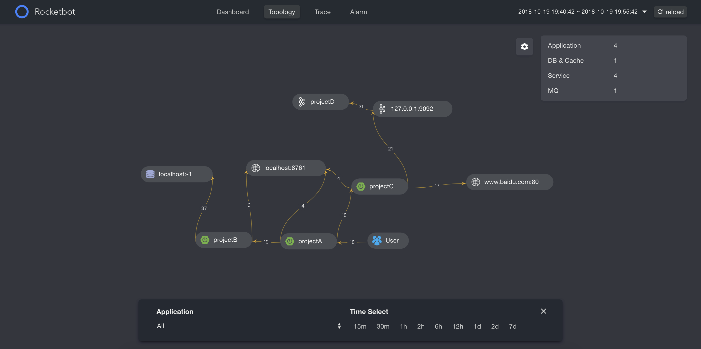
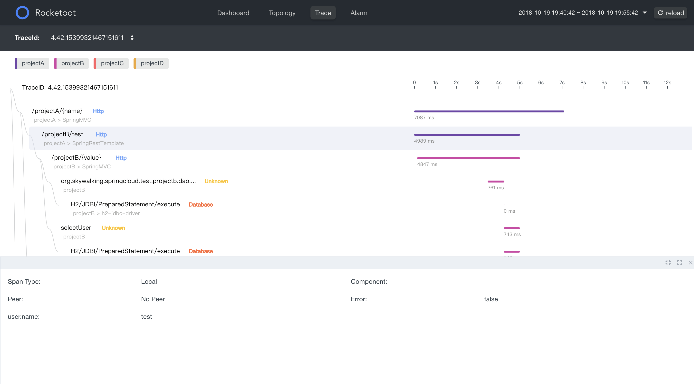

<p align="center"></p>
<h1 align="center"></h1>

<p align="center">
<a></a>
<a href="https://github.com/TinyAllen/rocketbot/blob/master/LICENSE"></a>
<a href="https://github.com/TinyAllen/rocketbot/blob/master/LICENSE"></a>
<a></a>
</p>

## Introduction
**RocketBot**: A modern and awesome UI for [Apache SkyWalking](https://github.com/apache/incubator-skywalking). This project is supported By [DaoCloud Labs](https://github.com/DaoCloud-Labs).

## Screenshots
**Dashboard**


**Topology**


**Trace**



## Live Demo
**[Demo](http://rocketbot.daocloud.io/)**

| Username        | Password           | 
| ------------- |:-------------:| 
| admin     | admin | 

## Document

Please read **[Docs](https://github.com/TinyAllen/rocketbot/blob/master/Document.md
)**

## Development

 The app was built with [vue + typescript](https://github.com/vuejs/vue).

### Prepare

Fork, then clone the `rocketbot` repo and change directory into it.

```
git clone https://github.com/TinyAllen/rocketbot.git
cd rocketbot
```

Install dependencies via `npm`:

```
npm install
```

### Run

The default collector query endpoint is `http://localhost:8080`.

#### Commands

| Command                 | Description                                                 |
| ----------------------- | ----------------------------------------------------------- |
| `npm start`             | Starts development server with hot reloading.      |
| `npm run host` | Starts development servers other can link             |
| `npm run lint`          | Lint the project (tslint)                        |
| `npm run build`         | Runs production build. Outputs files to `/dist`.            |

## Build

Running build will output all the static files to the `./dist` folder:

```
npm install
npm run build
```

[ci-img]: https://travis-ci.org/apache/incubator-skywalking-ui.svg?branch=master
[ci]: https://travis-ci.org/apache/incubator-skywalking-ui
[gitter-img]: https://badges.gitter.im/openskywalking/Lobby.svg
[gitter]: https://gitter.im/openskywalking/Lobby

## Docker Build

```
npm install
npm run build
docker build -t rocketbot .
```
### Running the docker image

```
docker run -p 8080:80 -d -e SKYWALKING_URL=127.0.0.1:1234,127.0.0.1:1235 rocketbot
```

`SKYWALKING_URL` is the address of your backend, multiple IP is changed by comma.


The default UI address is `http://localhost:8080`.

## Nginx config

### Reserve proxy

```
  location /api {
    rewrite ^/(.*) /graphql break;
    proxy_pass SKYWALKING_URL;
  }
```

**Important**: If you want to deploy the application by yourself，**you need to rewirte the URL path into ```/graphql``` before reserve proxy**.

## Contributing to RocketBot

Thanks for your interest and hope it will be a
pleasant experience.

### How to contribute?

Most of the contributions received are code contributions, and documentation, bugs, requirements are also welcomed.

### How to report a bug?

* **Ensure the bug was not already reported** by searching on GitHub under [Issues](https://github.com/TinyAllen/rocketbot/issues).

* If you're unable to find an open issue addressing the problem, [open a new one](https://github.com/TinyAllen/rocketbot/issues/new). Be sure to include a **title and clear description**, as much relevant information as possible, and a **code sample** or an **executable test case** demonstrating the expected behavior that is not occurring.

## Support


Supported by [DaoCloud Labs](https://github.com/DaoCloud-Labs).

## Contact

#### WeChat
<p>
  
</p>


## License

Copyright © 2018, [Allen Wang](https://github.com/TinyAllen). 
Released under the [MIT](http://opensource.org/licenses/MIT) License.

## Who Uses Rocketbot?
按照登记顺序排序，更多接入公司，欢迎在 [https://github.com/TinyAllen/rocketbot/issues/15](https://github.com/TinyAllen/rocketbot/issues/15) 登记（仅供开源用户参考）
<p>

&nbsp;&nbsp;
&nbsp;&nbsp;
&nbsp;&nbsp;
&nbsp;&nbsp;

</p>
